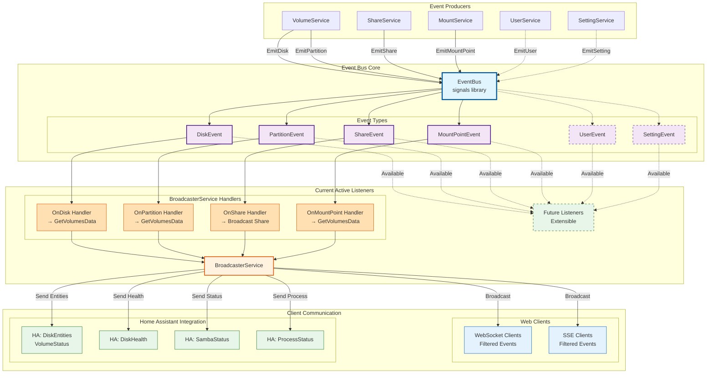

<!-- START doctoc generated TOC please keep comment here to allow auto update -->
<!-- DON'T EDIT THIS SECTION, INSTEAD RE-RUN doctoc TO UPDATE -->

- [Event-Driven Architecture Refactoring](#event-driven-architecture-refactoring)
  - [Overview](#overview)
  - [Architecture](#architecture)
    - [Core Components](#core-components)
      - [1. **EventBus** (`backend/src/events/event_bus.go`)](#1-eventbus-backendsrceventsevent_busgo)
      - [2. **Event Types** (`backend/src/events/events.go`)](#2-event-types-backendsrceventseventsgo)
    - [Event Flow Diagram](#event-flow-diagram)
  - [Integration Points](#integration-points)
    - [VolumeService](#volumeservice)
    - [ShareService](#shareservice)
    - [BroadcasterService](#broadcasterservice)
  - [Dependency Injection Setup](#dependency-injection-setup)
  - [Testing](#testing)
    - [Running Tests](#running-tests)
    - [Test Coverage](#test-coverage)
  - [Migration Path](#migration-path)
    - [Step 1: Verify Compilation](#step-1-verify-compilation)
    - [Step 2: Update Services to Emit Events](#step-2-update-services-to-emit-events)
    - [Step 3: Verify Event Reception](#step-3-verify-event-reception)
    - [Step 4: Test with Clients](#step-4-test-with-clients)
  - [Performance Considerations](#performance-considerations)
  - [Benefits](#benefits)
  - [Event Types Reference](#event-types-reference)
    - [Disk Events](#disk-events)
    - [Partition Events](#partition-events)
    - [Share Events](#share-events)
    - [Mount Point Events](#mount-point-events)
  - [Example: Adding a New Event Type](#example-adding-a-new-event-type)
  - [Debugging](#debugging)
    - [Enable Debug Logging](#enable-debug-logging)
    - [Check Event Flow](#check-event-flow)
    - [Common Issues](#common-issues)
  - [Migration Checklist](#migration-checklist)

<!-- END doctoc generated TOC please keep comment here to allow auto update -->

# Event-Driven Architecture Refactoring

## Overview

The SRAT backend has been refactored to use an **event-driven architecture** with the `github.com/maniartech/signals` library for inter-service communication. This replaces direct service-to-service coupling with a decoupled, event-based system.

## Architecture

### Core Components

#### 1. **EventBus** (`backend/src/events/event_bus.go`)

- Central event dispatcher using signals library
- Thread-safe event emission and subscription
- Supports multiple listeners per event type
- Automatic unsubscription via returned function handles

#### 2. **Event Types** (`backend/src/events/events.go`)

- `DiskEvent` - Disk added/removed events
- `PartitionEvent` - Partition added/removed events
- `ShareEvent` - Share created/updated/deleted/enabled/disabled events
- `MountPointEvent` - Mount point mounted/unmounted events

### Event Flow Diagram



## Integration Points

### VolumeService

**Changes Made:**

- Added `eventBus` field to struct
- Updated constructor to accept `EventBusInterface` via FX
- Ready to emit `DiskAdded`, `DiskRemoved`, `PartitionAdded`, `PartitionRemoved` events

**Key Methods to Update:**

```go
// When disk is detected:
service.eventBus.EmitDiskAdded(events.DiskEvent{Disk: disk})

// When disk is removed:
service.eventBus.EmitDiskRemoved(events.DiskEvent{Disk: disk})

// When partition is detected:
service.eventBus.EmitPartitionAdded(events.PartitionEvent{
    Partition: partition,
    Disk: disk,
})

// When partition is removed:
service.eventBus.EmitPartitionRemoved(events.PartitionEvent{
    Partition: partition,
    Disk: disk,
})
```

### ShareService

**Changes Made:**

- Added `eventBus` field to struct
- Updated constructor to accept `EventBusInterface` via FX
- Ready to emit share lifecycle events

**Key Methods to Update:**

```go
// When share is created:
service.eventBus.EmitShareCreated(events.ShareEvent{Share: share})

// When share is updated:
service.eventBus.EmitShareUpdated(events.ShareEvent{Share: share})

// When share is deleted:
service.eventBus.EmitShareDeleted(events.ShareEvent{Share: share})

// When share is enabled:
service.eventBus.EmitShareEnabled(events.ShareEvent{Share: share})

// When share is disabled:
service.eventBus.EmitShareDisabled(events.ShareEvent{Share: share})
```

### BroadcasterService

**Changes Made:**

- Added `eventBus` field to struct
- Updated constructor to accept `EventBusInterface`
- Automatically sets up event listeners in `setupEventListeners()`
- All received events are automatically broadcasted to connected clients

**Functionality:**

- Listens to all event types from EventBus
- Relays events through existing broadcast relay
- Filters events appropriately for different client types (SSE vs WebSocket)
- Sends events to Home Assistant if applicable

## Dependency Injection Setup

**File:** `backend/src/internal/appsetup/appsetup.go`

The EventBus is provided to FX with:

```go
func(ctx context.Context) events.EventBusInterface {
    return events.NewEventBus(ctx)
}
```

This ensures a single EventBus instance is available to all services.

## Testing

### Running Tests

```bash
cd backend
make test
# Or specifically for events:
go test ./events/... -v
```

### Test Coverage

- **Disk events** - Added, Removed
- **Partition events** - Added, Removed
- **Share events** - Created, Updated, Deleted, Enabled, Disabled
- **Mount point events** - Mounted, Unmounted
- **Multiple listeners** - Single event received by multiple listeners
- **Unsubscribe** - Listeners properly removed after unsubscription

All tests use synchronization primitives (WaitGroup, channels, timeouts) to ensure reliable execution.

## Migration Path

### Step 1: Verify Compilation

```bash
cd backend
make test_build
```

### Step 2: Update Services to Emit Events

For each service that detects state changes (volumes, shares, mounts), add event emission calls:

**VolumeService Example:**

```go
func (vs *VolumeService) detectNewDisk(disk *dto.Disk) {
    // ... existing logic ...

    // Emit event
    vs.eventBus.EmitDiskAdded(events.DiskEvent{Disk: disk})
}
```

### Step 3: Verify Event Reception

- Check logs for "Emitting" and "received" debug messages
- Verify BroadcasterService logs show event reception

### Step 4: Test with Clients

- Connect WebSocket/SSE clients
- Verify events are received on client side
- Check Home Assistant integration (if enabled)

## Performance Considerations

1. **Signal Library**: Efficient Go signal implementation with minimal overhead
2. **Goroutines**: Event handlers can be non-blocking (goroutine-safe)
3. **Memory**: Listeners are stored efficiently using closures
4. **Unsubscription**: Automatic cleanup via returned function handles

## Benefits

1. **Loose Coupling**: Services don't need direct references to each other
2. **Scalability**: Easy to add new event listeners without modifying existing code
3. **Testability**: Events can be tested independently
4. **Maintainability**: Clear event flow through the system
5. **Real-time Updates**: Automatic propagation to connected clients
6. **Future-proof**: Easy to add new event types and listeners

## Event Types Reference

### Disk Events

```go
type DiskEvent struct {
    Disk *dto.Disk
}
```

- `EmitDiskAdded(event)` - Fired when disk is detected
- `EmitDiskRemoved(event)` - Fired when disk is removed
- `OnDiskAdded(handler)` - Subscribe to disk additions
- `OnDiskRemoved(handler)` - Subscribe to disk removals

### Partition Events

```go
type PartitionEvent struct {
    Partition *dto.Partition
    Disk      *dto.Disk
}
```

- `EmitPartitionAdded(event)` - Fired when partition is detected
- `EmitPartitionRemoved(event)` - Fired when partition is removed
- `OnPartitionAdded(handler)` - Subscribe to partition additions
- `OnPartitionRemoved(handler)` - Subscribe to partition removals

### Share Events

```go
type ShareEvent struct {
    Share *dto.SharedResource
}
```

- `EmitShareCreated(event)` - Fired when share is created
- `EmitShareUpdated(event)` - Fired when share is updated
- `EmitShareDeleted(event)` - Fired when share is deleted
- `EmitShareEnabled(event)` - Fired when share is enabled
- `EmitShareDisabled(event)` - Fired when share is disabled
- All have corresponding `OnShare*` subscription methods

### Mount Point Events

```go
type MountPointEvent struct {
    MountPoint *dto.MountPointData
}
```

- `EmitMountPointMounted(event)` - Fired when mount point is mounted
- `EmitMountPointUnmounted(event)` - Fired when mount point is unmounted
- `OnMountPointMounted(handler)` - Subscribe to mount operations
- `OnMountPointUnmounted(handler)` - Subscribe to unmount operations

## Example: Adding a New Event Type

To add a new event type (e.g., `UserEvent`):

1. **Define event in `events.go`:**

```go
type UserEvent struct {
    User *dto.SambaUser
}
```

1. **Add to EventBusInterface in `event_bus.go`:**

```go
EmitUserCreated(event UserEvent)
OnUserCreated(handler func(UserEvent)) func()
```

1. **Implement in EventBus struct:**

```go
userCreated signals.Signal[UserEvent]

func (eb *EventBus) EmitUserCreated(event UserEvent) {
    slog.Debug("Emitting UserCreated event", "user", event.User.Name)
    eb.userCreated.Emit(event)
}

func (eb *EventBus) OnUserCreated(handler func(UserEvent)) func() {
    slog.Debug("Registering UserCreated event handler")
    return eb.userCreated.Connect(handler)
}
```

1. **Add listener in BroadcasterService:**

```go
broker.eventBus.OnUserCreated(func(event events.UserEvent) {
    slog.Debug("BroadcasterService received UserCreated event", "user", event.User.Name)
    broker.BroadcastMessage(event.User)
})
```

1. **Add tests in `event_bus_test.go`**

## Debugging

### Enable Debug Logging

```bash
srat-server -loglevel debug
```

### Check Event Flow

Look for these log messages:

- `Emitting [EventType] event` - Event was emitted
- `Registering [EventType] event handler` - Handler was registered
- `BroadcasterService received [EventType] event` - Event reached broadcaster
- `Queued Message` - Event was queued for broadcast

### Common Issues

**Events not reaching clients?**

1. Check BroadcasterService logs for event reception
2. Verify WebSocket connection is open
3. Ensure event filtering isn't hiding the event

**Multiple events for single change?**

1. Check if multiple services are emitting the same event
2. Consider debouncing at BroadcasterService level if needed

**Memory leaks?**

1. Ensure unsubscribe functions are called (they're returned from `On*` methods)
2. Use defer to guarantee cleanup

## Migration Checklist

- [ ] Verify `make test_build` compiles successfully
- [ ] Run `make test` - all tests pass
- [ ] Update VolumeService to emit disk/partition events
- [ ] Update ShareService to emit share events
- [ ] Test WebSocket client receives events
- [ ] Test SSE client receives events
- [ ] Verify Home Assistant integration (if used)
- [ ] Load test with high event frequency
- [ ] Document any custom event types added
