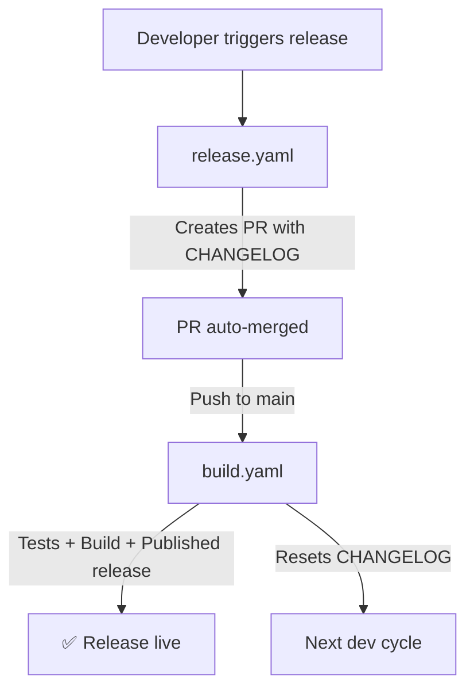

<!-- START doctoc generated TOC please keep comment here to allow auto update -->
<!-- DON'T EDIT THIS SECTION, INSTEAD RE-RUN doctoc TO UPDATE -->

**Table of Contents** *generated with [DocToc](https://github.com/thlorenz/doctoc)*

- [Release process (GitHub Actions)](#release-process-github-actions)
  - [Purpose](#purpose)
  - [How it works](#how-it-works)
  - [Usage](#usage)
  - [Manual trigger from GitHub UI](#manual-trigger-from-github-ui)
  - [What happens behind the scenes](#what-happens-behind-the-scenes)
  - [Prerequisites](#prerequisites)
  - [Troubleshooting](#troubleshooting)
  - [Where to look in the repo](#where-to-look-in-the-repo)

<!-- END doctoc generated TOC please keep comment here to allow auto update -->

# Release process (GitHub Actions)

This document explains how to create a release using the automated GitHub Actions workflows.

## Purpose

The release process automates version tagging, changelog management, building, and publishing. All running server-side in GitHub Actions. No local polling or waiting required.

## How it works

The release is orchestrated by two GitHub Actions workflows:

1. **`release.yaml`** — Triggered manually. Calculates the version (or uses a provided one), updates `CHANGELOG.md`, creates a release branch and PR with automerge.
2. **`build.yaml`** — Triggered by the PR merge push to `main`. Detects the release commit via its message, builds all artifacts, creates a **published** GitHub release (not draft), and resets `CHANGELOG.md` for the next development cycle.



## Usage

### From the command line (via mise)

```sh
# Auto-calculate version (next patch for current year.month)
mise run release

# Specify exact version
mise run release -- --version 2026.07.1
```

### From GitHub CLI

```sh
# Auto-calculate version
gh workflow run release.yaml --ref main

# Specify version
gh workflow run release.yaml --ref main -f version=2026.07.1
```

## Manual trigger from GitHub UI

1. Go to **Actions → Release → Run workflow**
2. Optionally enter a version (e.g. `2026.07.1`). Leave empty for auto-calculation.
3. Click **Run workflow**

The workflow will handle everything automatically. You can monitor progress in the Actions tab.

## What happens behind the scenes

| Step | Workflow | What it does |
| ------ | ---------- | ------------- |
| 1 | `release.yaml` | Calculates version (or uses input) |
| 2 | `release.yaml` | Replaces `## [ 🚧 Unreleased ]` with `## <version>` in CHANGELOG.md |
| 3 | `release.yaml` | Creates release branch and PR with auto-merge |
| 4 | GitHub | PR is auto-merged after CI passes |
| 5 | `build.yaml` | Detects release commit from merge commit message |
| 6 | `build.yaml` | Runs backend, frontend, and custom component tests |
| 7 | `build.yaml` | Builds all binaries and HACS component |
| 8 | `build.yaml` | Creates a **published** GitHub release (not draft) with all assets |
| 9 | `build.yaml` | Resets CHANGELOG.md for next development cycle |

## Prerequisites

- GitHub Actions must be enabled for the repository
- The `GITHUB_TOKEN` must have `contents: write` permission (default for Actions)
- A clean `CHANGELOG.md` with an `## [ 🚧 Unreleased ]` section

## Troubleshooting

### Build failed after CHANGELOG was updated

The CHANGELOG commit was pushed but `build.yaml` failed. To recover:
- Check the build failure in Actions → build
- Fix the issue and push to `main`
- The build will re-trigger and detect the release commit

### Re-running a failed release

If the release commit is already on `main` but the workflow failed:
```sh
# Re-trigger just the build
gh workflow run build.yaml --ref main

# Or re-trigger the full release process
gh workflow run release.yaml --ref main -f version=2026.07.1
```

## Where to look in the repo

- Release workflow: `.github/workflows/release.yaml`
- Build workflow (creates release + resets CHANGELOG): `.github/workflows/build.yaml`
- CHANGELOG: `CHANGELOG.md`
- Legacy script (deprecated): `scripts/release.sh`
