<!-- START doctoc generated TOC please keep comment here to allow auto update -->
<!-- DON'T EDIT THIS SECTION, INSTEAD RE-RUN doctoc TO UPDATE -->
**Table of Contents**

- [Test Coverage](#test-coverage)
  - [Current Coverage](#current-coverage)
  - [Coverage Thresholds](#coverage-thresholds)
  - [Backend Testing](#backend-testing)
    - [Framework & Tools](#framework--tools)
    - [Test Structure](#test-structure)
    - [Running Backend Tests](#running-backend-tests)
    - [Coverage Details](#coverage-details)
  - [Frontend Testing](#frontend-testing)
    - [Framework & Tools](#framework--tools-1)
    - [Test Structure](#test-structure-1)
    - [Running Frontend Tests](#running-frontend-tests)
    - [Coverage Details](#coverage-details-1)
  - [Global Coverage](#global-coverage)
  - [Coverage History](#coverage-history)
    - [Backend Coverage Over Time](#backend-coverage-over-time)
    - [Frontend Coverage Over Time](#frontend-coverage-over-time)
    - [Global Coverage Over Time](#global-coverage-over-time)
  - [Coverage Improvement Goals](#coverage-improvement-goals)
    - [Short-term Goals (Next Release)](#short-term-goals-next-release)
    - [Long-term Goals (6 months)](#long-term-goals-6-months)
  - [Best Practices](#best-practices)
    - [Backend Testing Best Practices](#backend-testing-best-practices)
    - [Frontend Testing Best Practices](#frontend-testing-best-practices)
  - [Updating Coverage Data](#updating-coverage-data)
  - [Resources](#resources)

<!-- END doctoc generated TOC please keep comment here to allow auto update -->

# Test Coverage

This document provides an overview of the test coverage for the SRAT project, including both backend (Go) and frontend (TypeScript/React) components.

## Current Coverage

| Component | Coverage | Status |
|-----------|----------|--------|
| Backend (Go) | 34.3% | 🟠 Orange |
| Frontend (TypeScript) | 70.30% | 🟢 Green |
| Global (Weighted) | 48.7% | 🟡 Yellow |

*Last updated: 2025-10-06*

## Coverage Thresholds

The project uses the following coverage thresholds for badge colors:

- **Bright Green** (>=80%): Excellent coverage
- **Green** (>=60%): Good coverage
- **Yellow** (>=40%): Acceptable coverage
- **Orange** (>=20%): Needs improvement
- **Red** (<20%): Critical - requires immediate attention

## Backend Testing

### Framework & Tools
- **Test Framework**: `testify/suite` with `mockio/v2` for mocks
- **HTTP Testing**: `humatest` for API endpoint validation
- **Coverage Tool**: Go's built-in `cover` tool
- **Minimum Coverage**: 5% (enforced in CI)

### Test Structure
Backend tests follow these patterns:
- Tests are in `{package}_test` packages
- Suite-based tests with `{HandlerName}HandlerSuite` structs
- Dependency injection using `fxtest.New()` and `fx.Populate()`
- Mock pattern: `mock.When(...).ThenReturn(...)` and `mock.Verify(...)`

### Running Backend Tests
```bash
cd backend
make test
```

### Coverage Details
The backend test coverage is calculated as the total percentage of statements covered across all packages. Key areas:

- **API Handlers** (`src/api/*`): Test HTTP endpoints with humatest
- **Services** (`src/service/*`): Business logic with mocked dependencies
- **Repositories** (`src/repository/*`): Data access layer testing
- **Converters** (`src/converter/*`): Auto-generated, typically high coverage
- **Utilities** (`src/tlog`, `src/internal/*`): Helper functions

## Frontend Testing

### Framework & Tools
- **Test Framework**: `bun:test` with `happy-dom` for DOM simulation
- **Component Testing**: `@testing-library/react` for component testing
- **Assertions**: `@testing-library/jest-dom` for DOM assertions
- **Coverage Tool**: Bun's built-in coverage tool
- **Minimum Coverage**: 80% functions coverage

### Test Structure
Frontend tests follow these mandatory patterns:
- Tests are in `__tests__` directories alongside components
- Test files use `.test.tsx` extension
- Dynamic imports for React components to avoid module loading issues
- Redux store integration using `createTestStore()` helper

### Running Frontend Tests
```bash
cd frontend
bun test --coverage
```

### Coverage Details
The frontend test coverage includes:

- **Components** (`src/components/*`): Reusable UI components
- **Pages** (`src/pages/*`): Route-based page components
- **Store** (`src/store/*`): Redux slices and RTK Query (excluding auto-generated API)
- **Hooks** (`src/hooks/*`): Custom React hooks
- **Utilities** (`src/utils/*`): Helper functions

## Global Coverage

The global coverage is calculated as a **weighted average**:
- **60% Backend** weight
- **40% Frontend** weight

This weighting reflects the relative importance and complexity of backend business logic versus frontend presentation logic.

**Formula**: `Global = (Backend × 0.6) + (Frontend × 0.4)`

## Coverage History

The following graphs show the evolution of test coverage over time.

### Backend Coverage Over Time


### Frontend Coverage Over Time

```mermaid
%%{init: {'theme':'base', 'themeVariables': { 'primaryColor':'#4CAF50','primaryTextColor':'#fff','primaryBorderColor':'#388E3C','lineColor':'#2196F3','secondaryColor':'#FFC107','tertiaryColor':'#fff'}}}%%
xychart-beta
    title "Frontend Test Coverage Over Time"
    x-axis [2025-10-06]
    y-axis "Coverage %" 0 --> 100
    line [70.30]
```



### Global Coverage Over Time

```mermaid
%%{init: {'theme':'base', 'themeVariables': { 'primaryColor':'#4CAF50','primaryTextColor':'#fff','primaryBorderColor':'#388E3C','lineColor':'#2196F3','secondaryColor':'#FFC107','tertiaryColor':'#fff'}}}%%
xychart-beta
    title "Global Test Coverage Over Time"
    x-axis [2025-10-06]
    y-axis "Coverage %" 0 --> 100
    line [48.7]
```



## Coverage Improvement Goals

### Short-term Goals (Next Release)
- **Backend**: Increase to 40% (+5.7%)
- **Frontend**: Maintain above 70%
- **Global**: Reach 50% (+1.3%)

### Long-term Goals (6 months)
- **Backend**: Reach 60% (+25.7%)
- **Frontend**: Reach 80% (+9.7%)
- **Global**: Reach 65% (+16.3%)

## Best Practices

### Backend Testing Best Practices
1. Always test both success and error paths
2. Use mocks for external dependencies (database, HTTP clients, etc.)
3. Verify state changes with `dirtyService.SetDirty*()` calls
4. Test with realistic data from `backend/test/data/`
5. Ensure tests are deterministic and can run in parallel

### Frontend Testing Best Practices
1. Use dynamic imports for React components
2. Clear localStorage before each test with `beforeEach()`
3. Use `screen.findByText()` for async rendering, not `getByText()`
4. Always use `React.createElement()` syntax in test files
5. Test user interactions, not implementation details

## Updating Coverage Data

Coverage data is automatically updated by running:

```bash
./scripts/update-coverage-badges.sh
```

This script:
1. Runs backend tests and extracts total coverage
2. Runs frontend tests and extracts coverage
3. Calculates global weighted coverage
4. Updates README.md badges
5. Updates this document with new data points and graphs

## Resources

- [Backend Testing Patterns](../backend/README.md#testing)
- [Frontend Testing Setup](../frontend/README.md#testing)
- [Copilot Instructions](../.github/copilot-instructions.md)
- [Pre-commit Hooks](../.pre-commit-config.yaml)
